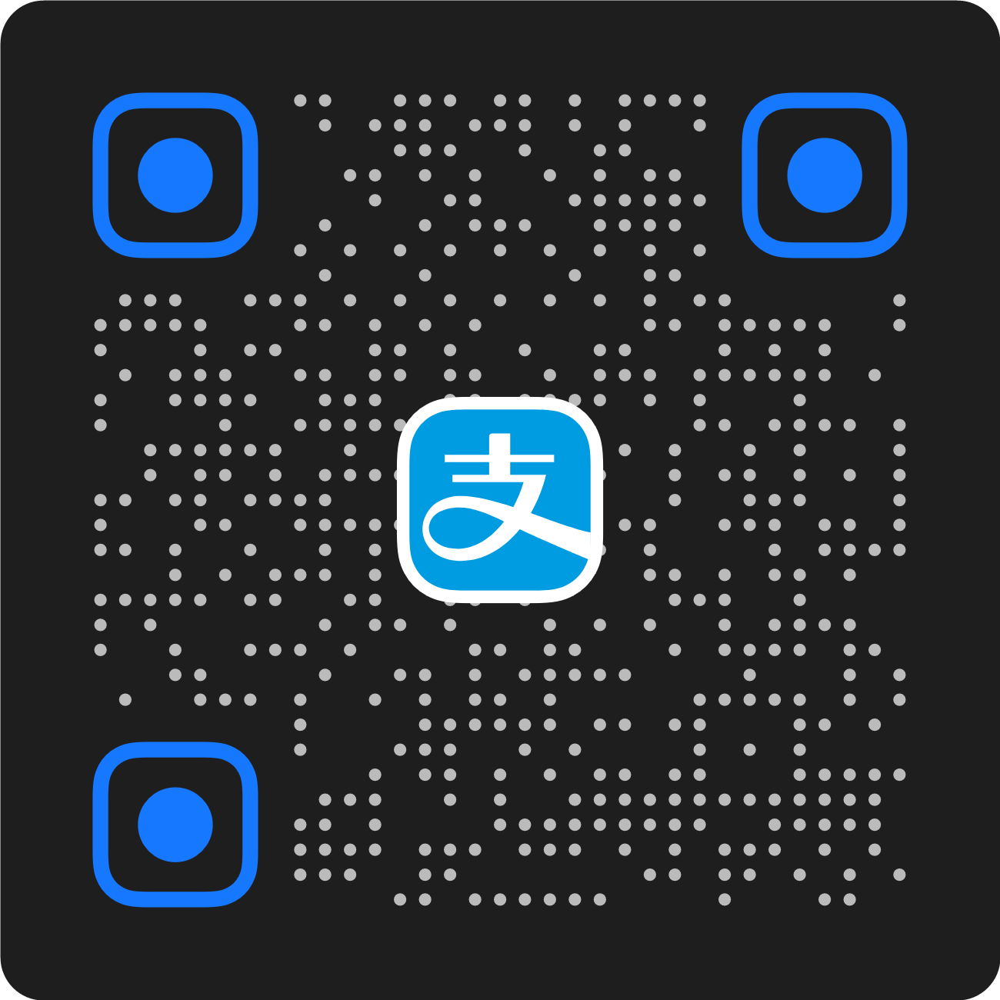

<div align="center">
  
  <p><a href="../README.md">简体中文</a> · <a href="./README.zh-HK.md">繁體中文（香港）</a> · <a href="./README.zh-TW.md">繁體中文（台灣）</a> · <a href="./README.en.md">English</a> · <a href="./README.ja.md">日本語</a> · <a href="./README.vi.md">Tiếng Việt</a> · <a href="./README.ko.md">한국어</a> · <strong>Español</strong> · <a href="./README.fr.md">Français</a> · <a href="./README.pt-BR.md">Português (Brasil)</a> · <a href="./README.pt-PT.md">Português (Portugal)</a> · <a href="./README.ru.md">Русский</a> · <a href="./README.de.md">Deutsch</a> · <a href="./README.it.md">Italiano</a></p>
  <h1>Flash Note Text</h1>
  <p><strong>Un espacio de trabajo de texto ligero para uTools: notas rápidas, edición Markdown, archivos con distintas codificaciones e imágenes para compartir.</strong></p>
</div>

Flash Note Text es un plugin de uTools para notas temporales y conversión de texto. Reúne edición de texto plano, Markdown y código con historial, recuperación de borradores, formato, detección de codificación, imágenes compartibles y AI opcional.

## Donaciones

Si Flash Note Text te ahorra tiempo al tomar notas, formatear o compartir texto, puedes apoyar al autor mediante los códigos QR siguientes. Elige un método de pago:

<p align="center">
  
  &nbsp;&nbsp;&nbsp;&nbsp;
  
</p>

## Funciones

- Modos de texto plano, Markdown y código; muestra el código fuente dentro del marcado Markdown y el resultado renderizado fuera.
- Historial, guardado automático, recuperación de borradores, búsqueda, vista previa, renombrado, eliminación y ordenación.
- Limpieza de saltos de línea, espacios, escapes, números de cita, enlaces, puntuación y espacios CJK/latinos.
- Selección automática o manual de lenguajes de código con CodeMirror y Shiki.
- Compatibilidad con UTF-8/16/32, GBK, GB18030, Big5, Shift_JIS, EUC-KR, Windows-1252 y Latin-1.
- Imágenes de notas, código, Xiaohongshu, Zhihu, WeChat y X.
- Interfaz en 14 idiomas, incluidos español, inglés, chino, japonés, vietnamita, coreano, francés, portugués, ruso, alemán e italiano.

## Instalación y desarrollo

1. Instala y abre [uTools](https://u.tools/).
2. Instálalo desde la [página del plugin de uTools](https://www.u-tools.cn/plugins/detail/%E9%97%AA%E5%BF%B5%E6%96%87%E6%9C%AC/), descarga el paquete desde [GitHub Releases](https://github.com/realSilasYang/flash-note-text/releases) o compílalo localmente.
3. Carga la carpeta `dist` generada en las herramientas de desarrollo de uTools.

```powershell
npm install
npm run release:build
```

Consulta la [README en chino simplificado](../README.md) para la guía completa, atajos, límites de datos y desarrollo.

## Licencia

Publicado bajo [MIT License](../LICENSE). Las fuentes, imágenes y temas de terceros conservan sus propias licencias.
